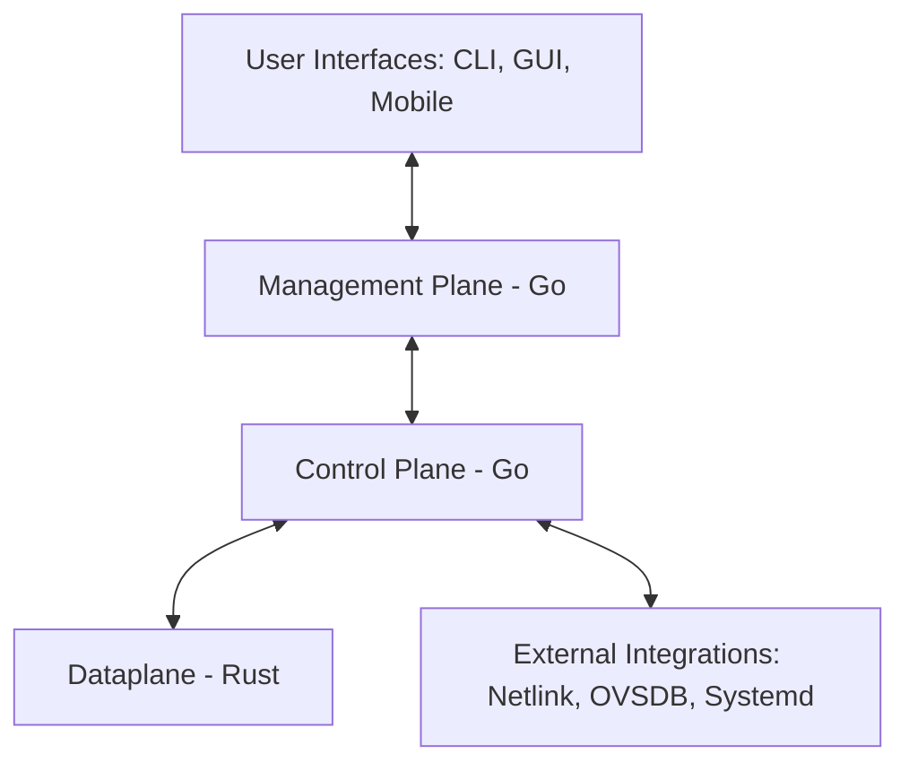

# Open-Source Layer 2 Switching Platform

[](LICENSE)
[](https://github.com/YourUsername/your-repo/actions)

---

## Overview

This project provides an **open-source, modular Layer 2 switch** for PC architecture. It supports:

- High-performance packet forwarding
- Feature-based, safe Rust dataplane
- Go-based control and management planes
- CLI, GUI, and mobile user interfaces
- Extensible architecture for advanced networking and ICS/enterprise scenarios

The platform is designed for **researchers, operators, and developers** who need a flexible, secure, and high-performance switching solution.

---

## Architecture

The system follows a **modular, phased architecture**:



### Components

| Component        | Language | Responsibilities                                                                                   |
|-----------------|---------|---------------------------------------------------------------------------------------------------|
| **Dataplane**   | Rust    | Packet I/O, MAC learning, VLAN tagging, forwarding logic, secure memory-safe implementation      |
| **Control Plane**| Go      | Switching protocols (STP, VLAN, MAC aging), policy computation, configuration persistence        |
| **Management**  | Go      | REST API (Northbound), RBAC, logging, monitoring, API versioning                                  |
| **User Interfaces** | CLI, Web, Mobile | Switch management, monitoring, configuration visualization                                   |
| **External Integrations** | Go | Linux Netlink, OVSDB, systemd integration                                                        |

For detailed architecture and module boundaries, see [ARCHITECTURE.md](./ARCHITECTURE.md).

---

## Roadmap

### Phase 1: Foundations (0–3 months)
- Repo setup, license, CI/CD pipelines  
- Basic Linux stack packet forwarding (DPDK/eBPF or OVS baseline)  
- Documentation: `README.md`, `INSTALL.md`, Developer Setup Guide

### Phase 2: Core Switching Features (3–6 months)
- MAC learning table, VLAN support, RSTP  
- Persist configuration via systemd  
- Integration tests for forwarding, VLAN, and interfaces

### Phase 3: Management & APIs (6–9 months)
- REST API, RBAC enforcement  
- Logging and monitoring (Graylog, Prometheus)  
- Netlink/OVSDB integration

### Phase 4: User Interfaces (9–12 months)
- CLI, web GUI, mobile app prototype  
- Theme and layout customization  
- Docker image deployment

### Phase 5: Advanced Switching & Performance (12–18 months)
- Link aggregation (LACP), QoS, ACLs  
- Performance optimization with DPDK/eBPF  
- Benchmarking with iperf, TRex

### Phase 6: Ecosystem & Community (18–24 months)
- Documentation website (MkDocs/Sphinx)  
- SDKs for Python, Go, Node.js  
- Release v1.0.0  
- Community engagement and security hardening

For full roadmap, see [Roadmap.md](./Roadmap.md).

---

## Getting Started

### Prerequisites

- **Rust:** 1.70+ (dataplane)  
- **Go:** 1.21+ (control & management planes)  
- **Linux:** Ubuntu/Debian recommended  
- `make`, `git`, `docker` (optional)

### Clone Repository

```bash
git clone https://github.com/YourUsername/your-repo.git
cd your-repo
```

### Build Dataplane (Rust)

```bash
cd src
cargo build --release
```

### Build Control & Management Planes (Go)

```bash
cd internal
go build ./features/...
```

### Run Tests

```bash
# Rust
cargo test --all-features

# Go
make test
```

### Run Locally

```bash
# Start control & management
./internal/features/control_plane/main
./internal/features/management/main

# Run Rust dataplane
./src/target/release/dataplane
```

---

## Documentation

- Architecture: [ARCHITECTURE.md](./ARCHITECTURE.md)  
- Roadmap: [Roadmap.md](./Roadmap.md)  
- Developer Setup Guide: `DEVELOPER_SETUP.md`  
- Feature PRDs: `src/features/<feature>/prd.md` or `internal/features/<feature>/prd.md`  

---

## Contribution Guidelines

We follow **AIBD-RG coding standards** for Rust and Go:

- Feature-based module boundaries  
- One declaration per file  
- Type safety first  
- CI-enforced formatting, linting, and security checks  

See [AI Based Coding Rules for Rust and Go Development](./AI%20Based%20coding%20rules%20for%20Rust%20and%20Go%20development.md) for details.

---

## License

This project is licensed under the [MIT License](LICENSE).

---

## Contact & Support

For issues, please open a GitHub Issue or pull request.  
For discussions and feature requests, use the repository Discussions tab.
