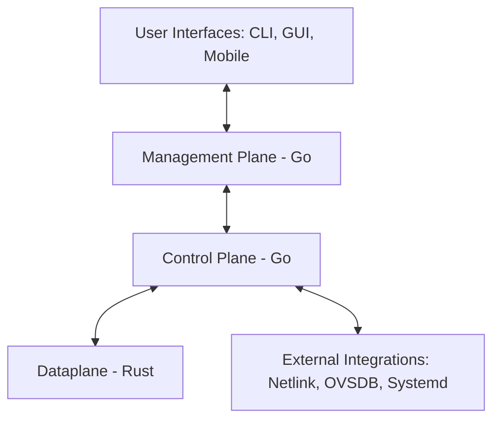

# Open-Source Layer 2 Switching Platform

[](LICENSE)
[](https://github.com/YourUsername/your-repo/actions/workflows/ci.yml)
[](#) <!-- placeholder -->
[](https://github.com/YourUsername/your-repo/releases)

---

## Table of Contents

1. [Overview](#overview)
2. [Architecture](#architecture)
3. [Roadmap](#roadmap)
4. [Getting Started](#getting-started)
5. [Quick Start / Demo](#quick-start--demo)
6. [Documentation](#documentation)
7. [Contribution Guidelines](#contribution-guidelines)
8. [License](#license)
9. [Contact & Support](#contact--support)

---

## Overview

This project provides an **open-source, modular Layer 2 switch** for PC architecture. It supports:

- High-performance packet forwarding
- Feature-based, safe Rust dataplane
- Go-based control and management planes
- CLI, GUI, and mobile user interfaces
- Extensible architecture for advanced networking and ICS/enterprise scenarios

**Supported platforms:** Linux (Ubuntu/Debian recommended), PC x86_64 architecture  
**Minimum requirements:** 4GB RAM, 2 CPU cores, 20GB disk space

---

## Architecture

The system follows a **modular, phased architecture**:



### Components

| Component        | Language | Responsibilities                                                                                   |
|-----------------|---------|---------------------------------------------------------------------------------------------------|
| **Dataplane**   | Rust    | Packet I/O, MAC learning, VLAN tagging, forwarding logic, secure memory-safe implementation      |
| **Control Plane**| Go      | Switching protocols (STP, VLAN, MAC aging), policy computation, configuration persistence        |
| **Management**  | Go      | REST API (Northbound), RBAC, logging, monitoring, API versioning                                  |
| **User Interfaces** | CLI, Web, Mobile | Switch management, monitoring, configuration visualization                                   |
| **External Integrations** | Go | Linux Netlink, OVSDB, systemd integration                                                        |

For detailed architecture and module boundaries, see [Architecture](docs/ARCHITECTURE.md).

---

## Roadmap

See [Roadmap](ROADMAP.md) for full details. Current focus is on **Phase 1: Foundations**, implementing basic packet forwarding, CI/CD setup, and developer setup docs.

---

## Getting Started

### Prerequisites

- **Rust:** 1.70+ (dataplane)  
- **Go:** 1.21+ (control & management planes)  
- **Linux:** Ubuntu/Debian recommended  
- Tools: `make`, `git`, `docker` (optional)

### Clone Repository

```bash
git clone https://github.com/YourUsername/your-repo.git
cd your-repo
```

### Build Dataplane (Rust)

```bash
cd src
cargo build --release
```

### Build Control & Management Planes (Go)

```bash
cd internal
go build ./features/...
```

### Run Tests

```bash
# Rust
cargo test --all-features

# Go
make test
```

### Run Locally

```bash
# Start control & management
./internal/features/control_plane/main
./internal/features/management/main

# Run Rust dataplane
./src/target/release/dataplane
```

---

## Quick Start / Demo

You can run a minimal demo to validate forwarding and VLAN:

```bash
# Start dataplane in test mode
cargo run --bin dataplane -- --test-vlan 1

# Start control plane in background
./internal/features/control_plane/main &

# Add sample MAC entries (CLI or API)
curl -X POST http://localhost:8080/api/v1/mac -d '{"mac":"00:11:22:33:44:55","vlan":1}'
```

Check logs to see **packet forwarding behavior**. This allows quick validation without full deployment.

---

## Documentation

- Architecture: [Architecture](docs/ARCHITECTURE.md)  
- Roadmap: [Roadmap](ROADMAP.md)  
- Developer Setup Guide: `DEVELOPER_SETUP.md`  
- Feature PRDs: `src/features/<feature>/prd.md` or `internal/features/<feature>/prd.md`  
- Coding Guidelines: [AI Based Coding Rules](AI-Based-Coding-Rules-for-Rust-and-Go-Development.md)  
- API Docs (once REST API is available): `specs/api/openapi.yaml`

---

## Contribution Guidelines

We follow **AIBD-RG coding standards** for Rust and Go:

- Feature-based module boundaries  
- One declaration per file  
- Type safety first  
- CI-enforced formatting, linting, and security checks  

**GitHub Best Practices:**

- Fork repository and submit PRs  
- Use conventional commit messages (feat, fix, chore, docs, etc.)  
- Use issue templates for bugs, features, and support  
- Follow branch naming: `feature/<name>` or `bugfix/<name>`  

See [AI Based Coding Rules](AI-Based-Coding-Rules-for-Rust-and-Go-Development.md) for full guidelines.

---

## License

This project is licensed under the [MIT License](LICENSE).

---

## Contact & Support

For issues, please open a GitHub Issue or pull request.  
For discussions, feature requests, and general support, use the repository Discussions tab.  
For urgent queries, reach out to **maintainers** via GitHub or the contact email provided in `DEVELOPER_SETUP.md`.
