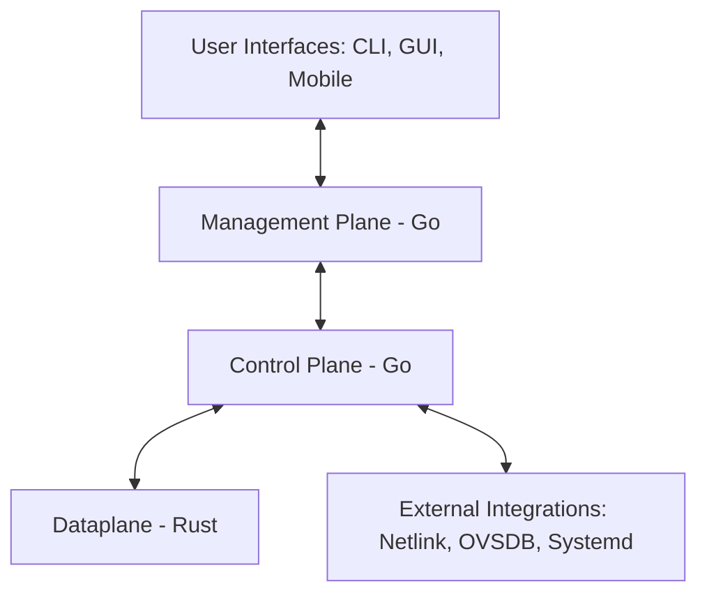

# ARCHITECTURE.md

## 1. Introduction
This document defines the **high-level architecture** of the Open-Source Layer 2 Switching Platform.  
It establishes the major components, their boundaries, and how they interact.  

The architecture directly supports the goals in [ROADMAP.md](./ROADMAP.md):  
- Modular design: **dataplane (Rust)**, **control plane (Go)**, **management plane (Go)**, and user interfaces.  
- Documentation-as-code: all design docs, requirements, and interfaces live in this repository.  
- Clear boundaries enforced across components, per AIBD-RG guidelines.  

---

## 2. Vision
We aim to deliver a **modular, extensible, performant Layer 2 switch** suitable for researchers, operators, and developers.  

Key goals:  
- **Safety & Performance:** Rust dataplane for memory safety and predictable throughput.  
- **Simplicity & Extensibility:** Go for control and management layers (fast iteration, ecosystem strength).  
- **Phased Delivery:** Each Roadmap phase builds progressively.  
- **Traceability:** Every feature has a `prd.md`, linked to acceptance tests.  

---

## 3. High-Level Component Architecture

### 3.1 Dataplane (Rust)
**Responsibilities**  
- Packet I/O (initially Linux networking stack).  
- Core switching logic: MAC learning, VLAN tagging, flooding, unicast forwarding.  
- Expose APIs for control plane updates (forwarding table, VLAN config).  

**Properties**  
- Rust only; `#![forbid(unsafe_code)]`.  
- Features in `src/features/`, shared utilities in `src/shared/`.  
- Clear PRD per feature (`src/features/forwarding/prd.md`).  

**Repo Layout Example**
```text
src/
├── main.rs
├── lib.rs
├── features/
│   └── forwarding/
│       ├── prd.md
│       ├── mod.rs
│       ├── types.rs
│       ├── service.rs
│       └── internal/
│           ├── mac_table.rs
│           └── pipeline.rs
└── shared/
    └── utils.rs
```

---

### 3.2 Control Plane (Go)
**Responsibilities**  
- Implements switching protocols (STP, VLAN, MAC aging).  
- Computes policies and pushes updates into the dataplane via IPC/RPC.  
- Persists configuration (systemd integration in Phase 2).  

**Properties**  
- Written in Go.  
- Organized in `internal/features/` with PRDs.  
- Dependency boundaries: features only depend on `internal/shared/`.  

---

### 3.3 Management Plane (Go)
**Responsibilities**  
- Northbound APIs (REST Phase 3, gRPC future).  
- RBAC enforcement.  
- Logging/monitoring (syslog, Graylog, Prometheus).  

**Properties**  
- Runs independently of control plane logic.  
- OpenAPI definitions stored in `specs/api/openapi.yaml`.  
- API PRD in `internal/features/management/prd.md`.  

---

### 3.4 User Interfaces (Future Phases)
- CLI (Phase 4)  
- Web GUI (Phase 4)  
- Mobile App (Phase 4+)  

---

## 4. Interfaces & Communication
- **Dataplane ↔ Control Plane**  
  - IPC/RPC (UNIX sockets initially; future: gRPC).  
  - Contract definitions in `specs/forwarding.proto`.  

- **Control Plane ↔ Management Plane**  
  - REST/gRPC APIs.  
  - Management requests → control plane applies → dataplane enforces.  

- **External Integrations**  
  - Linux Netlink (Phase 3).  
  - OVSDB (Phase 3).  
  - systemd service (Phase 2).  

**Rule:** Cross-component APIs must live in `specs/` (protobuf/OpenAPI) and be versioned.  

---

## 5. Roadmap Alignment
The architecture evolves along the Roadmap:  
- **Phase 1:** Basic forwarding (Linux stack), repo setup, CI/CD, docs.  
- **Phase 2:** MAC learning, VLAN, STP, persistence.  
- **Phase 3:** REST API, RBAC, monitoring, integrations.  
- **Phase 4:** CLI, GUI, Mobile.  
- **Phase 5:** Advanced switching (LACP, QoS, ACLs, DPDK/eBPF).  
- **Phase 6:** Ecosystem (SDKs, docs site, demo labs, v1.0 release).  

---

## 6. Technology Choices
- **Languages:** Rust (dataplane), Go (control/management).  
- **Baseline:** Linux networking stack → future DPDK/eBPF.  
- **CI/CD:** GitHub Actions with linting, testing, security scans.  
- **Documentation-as-Code:** All specs and docs tracked in repo.  

---

## 7. Dependency & Module Boundaries
- **Rust**  
  - Features only depend on `src/shared/`.  
  - Use `pub(crate)` for crate-wide visibility.  
  - Enforced by CI (cargo-deps).  

- **Go**  
  - Features in `internal/features/`, depend only on `internal/shared/`.  
  - No circular dependencies.  
  - Enforced by CI (import cycle checks).  

---

## 8. Testing & Quality
- **PRD-driven tests:** Every acceptance criterion maps to unit/integration/e2e tests.  
- **CI Enforcement:**  
  - Rust: `cargo fmt`, `clippy`, `test`, `cargo-audit`, `cargo-deny`.  
  - Go: `gofmt`, `golangci-lint`, `go test -race`, `gosec`, `govulncheck`.  
- **Integration Tests:** Confirm dataplane forwards packets.  
- **Future:** Benchmark suite (iperf, TRex).  

---

## 9. Security
- Rust: forbid unsafe code.  
- Go: secure defaults (timeouts, TLS 1.2+).  
- Input validation: Rust (`validator`), Go (struct tags).  
- Security scans in CI.  

---

## 10. Architecture Diagram
### Mermaid Diagram


### Rendered Diagram
See `docs/l2_switch_architecture.png` and `docs/l2_switch_architecture.svg`.  

---

## 11. Future Extensions
- Hardware offload (FPGA/NIC).  
- Overlay networking (VXLAN, GRE).  
- Multi-chassis link aggregation.  
- SDN controller integration.  
- Pluggable policy engine for ICS/enterprise use cases.  
